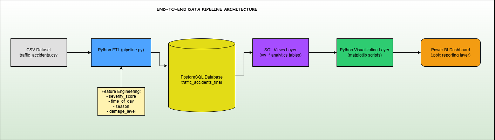

# End-to-End Traffic Accident Analytics Pipeline with Python, PostgreSQL, SQL Views, and Power BI

## Project Overview
This project demonstrates an end-to-end data engineering workflow that ingests raw traffic accident data from CSV, performs data cleaning and feature engineering using Python, loads transformed data into PostgreSQL, creates analytical SQL views, generates visualizations with Matplotlib, and delivers dashboard-ready insights through Power BI.

### Business Scenario

Traffic analytics teams aim to understand accident patterns in a structured and analytical way. This includes identifying the leading causes of injuries, analyzing trends over time, distinguishing whether accidents are driver-related or road/environment-related, determining high-risk days of the week, estimating damage levels, and evaluating whether incidents typically involve single or multiple units.

### Tech Stack

#### Programming Language
- Python 3.12

#### Data Processing
- Pandas

#### Database Connectivity
- SQLAlchemy

#### Database
- PostgreSQL

#### SQL Analytics Layer
- PostgreSQL Views

#### Visualization
- Matplotlib
- Power BI

#### Pipeline Orchestration
- Python ETL Pipeline (custom-built workflow using pipeline.py)

#### Configuration Management
- python-dotenv

#### Data Source & Storage
- CSV (traffic_accidents.csv)

#### Documentation & Design
- Draw.io (Architecture Diagram)
- Markdown (README)

#### Version Control
- Git
- GitHub

### Dataset Description

The dataset used in this project is the **Traffic Accidents dataset** sourced from Kaggle (Oktayrdeki). It contains structured records of traffic accident events across multiple regions and time periods.

The dataset includes information related to accident timing, environmental conditions, crash characteristics, injury outcomes, and vehicle involvement. Each row represents a single accident incident.

#### Key Attributes

- Accident date and time information
- Weather conditions during the incident
- Lighting conditions at the time of the crash
- Type of crash or collision
- Number of vehicles involved
- Injury-related metrics including severity and total injury counts
- Road and environmental conditions
- Primary contributory cause of the accident

#### Dataset Scope

The dataset covers multiple regions and accident scenarios, allowing analysis of patterns in traffic incidents across different environmental and behavioral conditions.

### System Architecture

The architecture of this project is illustrated below:



#### Overview

The pipeline follows a structured end-to-end data flow:

CSV Dataset → Python ETL Pipeline → PostgreSQL Database → SQL Views Layer → Python Visualization Layer → Power BI Dashboard

#### Description of Layers

- **CSV Dataset**: Raw traffic accident data source.
- **Python ETL Pipeline**: Handles extraction, cleaning, and feature engineering using pandas.
- **PostgreSQL Database**: Stores transformed and structured data.
- **SQL Views Layer**: Creates aggregated analytical metrics for reporting.
- **Python Visualization Layer**: Generates exploratory charts using matplotlib.
- **Power BI Dashboard**: Final reporting and visualization layer for insights.

#### Design Principle

The system is designed with a modular, layered architecture to ensure:
- Clear separation of ETL, storage, analytics, and visualization
- Reproducibility of the pipeline
- Scalability for additional analytical views or datasets

### Feature Engineering

Feature engineering was performed within the Python ETL pipeline to transform raw accident records into analytical features that improve aggregation, classification, and trend analysis in downstream SQL views and dashboards.

#### Injury Severity Features

- **severity_score**: A weighted score calculated based on injury types, where more severe injuries contribute higher weights.
- **is_severe**: A binary flag indicating whether an accident is considered severe based on severity_score.

#### Time-Based Features

- **day_type**: Classifies accidents into weekday or weekend based on the day of the week.
- **time_of_day**: Categorizes accidents into time segments (e.g., daytime, afternoon, evening, unknown).
- **season**: Derives seasonal grouping from the month of the accident.
- **month_name**: Converts numerical month values into readable month labels.

#### Accident Structure Features

- **multi_unit**: Indicates whether an accident involved more than one vehicle.

#### Damage Classification

- **damage_level**: Categorizes accident severity based on reported property monetary damage into Low, Medium, and High levels.

#### Cause Classification

- **cause_category**: Groups primary contributory causes into higher-level categories:
  - Driver-related
  - Road-related
  - Environmental-related
  - Unknown
  - Other

#### Derived Analytical Flags

To support SQL-based aggregation and visualization, additional boolean flags were created:

- **is_driver_related**
- **is_road_related**
- **is_environment_related**
- **is_unknown_cause**
- **is_other_cause**

#### Purpose of Feature Engineering

These engineered features enable:
- Simplified SQL aggregations using grouped categories
- Improved readability for dashboard visualizations
- Consistent classification of accident severity and causes
- Enhanced analytical depth without modifying raw data structure

### SQL Metrics Layer

The SQL metrics layer was implemented using PostgreSQL views to transform the cleaned dataset into aggregated analytical tables optimized for reporting and visualization.

This layer serves as a bridge between the transformed dataset and the visualization layer by precomputing key business metrics.

#### Purpose of the Metrics Layer

- Reduce complexity in visualization queries
- Standardize aggregation logic across dashboards
- Improve performance by precomputing summaries
- Enable reusable analytical datasets

#### Key Analytical Views

#### 1. **Monthly Trend Analysis**
Aggregates total accidents by month to identify temporal patterns and long-term trends.

#### 2. **Seasonal Trend Analysis**
Groups accidents by season to analyze environmental and temporal impact on accident frequency.

#### 3. **Cause-Based Severity Analysis**
Evaluates the relationship between accident causes and average severity scores.

#### 4. **Time of Day Injury Analysis**
Compares accident frequency and severity across different time periods of the day.

#### 5. **Damage Level Distribution**
Aggregates accidents based on categorized monetary damage levels to understand severity distribution.

#### 6. **Multi-Unit vs Single-Unit Comparison**
Analyzes differences in accident frequency and injury occurrence between single-vehicle and multi-vehicle incidents.

#### *Design Principle*

All SQL views were designed to:
- Perform pre-aggregation for dashboard readiness
- Maintain consistency in KPI definitions
- Enable fast retrieval for visualization tools such as Power BI and matplotlib

### Visualizations

The visualization layer represents the final output of the analytical pipeline, converting SQL-based metrics into interpretable visual insights.

#### - Matplotlib Outputs

Matplotlib was used to generate static charts for exploratory analysis and validation of trends derived from SQL views.

These outputs visually represent key patterns such as accident trends, severity distribution, time-based analysis, and categorical comparisons.

#### - Power BI Dashboard

Power BI serves as the interactive reporting layer of the project, built on top of PostgreSQL SQL views.

It provides business-ready dashboards for exploring accident trends, severity metrics, and categorical breakdowns through interactive filtering and visualization.

### Project Structure
```
traffic-accident-pipeline/
│
├── .env (ignored)
├── .env.example
├── .gitignore
├── README.md
├── requirements.txt
│
├── Data/(ignored)
│   ├── archive/
│   │   └── traffic_accidents.csv 
│   └── versions/ 
│       └── cleaned_traffic_accidents_*.csv
│
├── scripts/
│   ├── pipeline.py
│   ├── visualization.py
│   ├── views_py/ (auto-generated matplotlib outputs)
│   └── __pycache__/ (ignored)
│
├── sql/
│   └── views/
│       └── views.sql
│
└── visuals/
    ├── traffics_accidents_final_visuals.pbix
    └── screenshots_views/ (powerbi charts)
```
### Setup Instructions

This project is designed to run end-to-end from raw data ingestion to visualization and dashboard generation.

#### Step 1: Clone the Repository
```
bash
git clone <your-repo-url>
cd traffic-accident-pipeline
```
#### Step 2: Create Virtual Environment
```
bash
python -m venv venv
venv\Scripts\activate
```
#### Step 3: Install Dependencies
```
bash
pip install -r requirements.txt
```
#### Step 4: Configure Environment Variables

Copy the provided `.env.example` file and rename it to `.env`.

Example:

```bash
cp .env.example .env
```

On Windows, simply duplicate `.env.example` and rename the copy to `.env`.

Then update the database credentials in `.env` to match your local PostgreSQL configuration.

```env
DB_HOST=localhost
DB_PORT=5432
DB_NAME=your_database
DB_USER=your_username
DB_PASSWORD=your_password

DB_DATA_PATH=Data/archive/traffic_accidents.csv
TRANSFORMED_DATA_PATH=Data/versions
VIEWS_PATH=sql/views/views.sql
VISUALS_PATH=scripts/views_py
```
#### Step 5: Download Dataset

Download the dataset from Kaggle:

https://www.kaggle.com/datasets/oktayrdeki/traffic-accidents/data

Place it in:

Data/archive/traffic_accidents.csv

#### Step 6: Run the ETL Pipeline

Ensure your terminal is opened at the project root (`traffic-accident-pipeline`) before running the pipeline.

```
bash
python scripts/pipeline.py
```
Pipeline execution includes:

1. Extract raw CSV data
2. Data cleaning and feature engineering
3. Load transformed data into PostgreSQL
4. Create SQL analytical views
5. Generate cleaned dataset versions
6. Trigger visualization generation

#### Step 7: Verify Outputs

PostgreSQL table: traffic_accidents_final
SQL views created successfully
Cleaned datasets saved in Data/versions/
Select distinct run_id if matches the version
Visualizations saved in visuals/

### Power BI Dashboard

The Power BI dashboard is built on top of the PostgreSQL analytics layer using a direct database connection.

Power BI connects to SQL views created in the database, which serve as the curated analytical layer of the pipeline. This enables the dashboard to dynamically reflect updated data whenever the underlying tables or views are refreshed.

#### *Data Flow Integration*
- PostgreSQL database acts as the single source of truth
- SQL views provide pre-aggregated and analysis-ready datasets
- Power BI consumes these views as its data source

#### *Refresh Behavior*
The dashboard supports data refresh through its live connection to PostgreSQL. When the ETL pipeline is rerun and the database is updated, the Power BI visuals reflect the latest data after refresh.

#### *Limitations*
The dashboard layout and visual design are created manually in Power BI Desktop and are not programmatically generated by the pipeline.

The final report is saved as:
`visuals/traffic_accidents_final_visuals.pbix`

### Reproducibility Note

The pipeline is designed to be idempotent at the database level. Each execution truncates and reloads the target table, ensuring consistent outputs across runs given the same input dataset and environment configuration.

### SIDE NOTES (DATA QUALITY + INTERPRETATION)

#### Matplotlib vs Power BI Differences
- Minor rendering differences (labels, spacing, layout)
- Data remains identical across both systems

#### Cause Category: OTHER
Represents valid but uncategorized causes.  
This preserves data integrity while maintaining grouped analytical structure.

#### Cause Category: UNKNOWN
Represents missing or inconclusive values.  
Example: “UNABLE TO DETERMINE”

#### Data Validation Check
```
SQL
SELECT *
FROM traffic_accidents_final
WHERE cause_category = 'OTHER';
```
#### PNG Timestamp Behavior
OS caching may prevent visible timestamp update
Files are still correctly overwritten during pipeline execution
